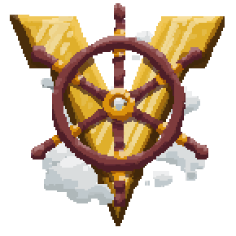

<h1 align="center">
Valkyrien Skies 2 — Unofficial Fabric Port
</h1>

> ⚠️ **Unofficial port — not affiliated with or endorsed by the Valkyrien Skies team.** A community **Fabric** port of VS2 to newer Minecraft versions. It may be less polished than official VS — use at your own risk, no official support. The badges above link to the **official** Valkyrien Skies works; please support the team there.

*The physics mod to end all other physics mods. Better compatibility, performance, collisions, interactions and physics than anything prior!*

## About this port

This is a **Fabric-only** port of Valkyrien Skies 2 to **Minecraft 1.20.1, 1.21.1, and 1.21.11**, focused on getting Eureka ships fully playable on current versions — including under shaders. Everything from official VS2 that could be carried over is here, plus a set of port-specific rendering, physics, and quality-of-life additions.

Pair it with the matching **[Eureka! Ships! (VS2)](https://github.com/Eminai-LeoVinci/Eureka-Ships)** build to place a helm and turn any build into a sailable ship.

## Highlights

- **Ships render under Sodium + Iris shaders** — with shadows, emissive / PBR blocks, and swaying foliage; large fleets stay smooth.
- **Ocean bob & sway** — ships heave and roll on the swells with the pilot riding along (VS2-native, no Physics Mod).
- **Ride anywhere** — relog on a moving ship safely, keep the ship's influence when you jump off, a sit-down hotkey, an F5 ship-camera cycle, and controller steering.
- **Living decks** — mobs, villagers, and armor stands path and stay synced on moving ships.

See the [**Releases**](https://github.com/Eminai-LeoVinci/VS2/releases) page for the complete, current feature list.

## Installation

1. Install **Fabric Loader** + **Fabric API**, and **Sodium** (required — ship terrain won't render without it).
2. Download the jar for your Minecraft version from [**Releases**](https://github.com/Eminai-LeoVinci/VS2/releases) or Modrinth.
3. Add the matching **Eureka (VS2)** build for ship building.

*Official Valkyrien Skies (other versions / loaders) is available from the [official website](https://www.valkyrienskies.org/download).*

> VS2's internal debug / test items are **excluded** from this build.

## Credits & License

Valkyrien Skies 2 was originally created by **Triode** and **Rubydesic**, with contributions from the wider VS team (see the upstream git history). The Create compatibility code was originally and largely written by [FluffyJenkins](https://github.com/FluffyJenkins/). This unofficial port is maintained by **Eminai-LeoVinci** and is not affiliated with the Valkyrien Skies team.

Released under the **GNU GPL v3**, in keeping with the upstream project and the VS team's guidance for community ports.
